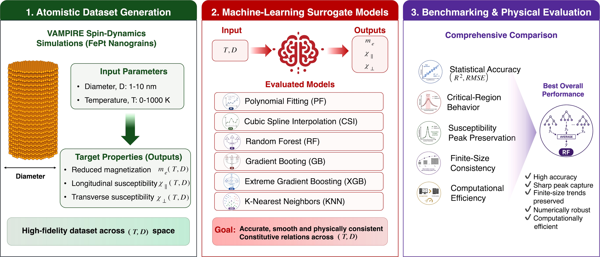

# MagSurrogate

Machine-Learning Surrogate Models:

This repository provides the dataset, source code, benchmarking workflow, and physics-analysis tools.

<p align="center">
  
</p>

<p align="center">
<b>Figure 1.</b> Overview of the MagSurrogate framework, including atomistic data generation, machine-learning benchmarking, surrogate-model construction, finite-size scaling analysis, and universal scaling collapse.
</p>

## Objective

Atomistic spin simulations provide highly accurate predictions of finite-temperature magnetic properties, but they are computationally expensive when large parameter sweeps or multiscale simulations are required. For FePt nanograins, evaluating temperature-dependent constitutive relations across multiple grain sizes may require thousands of individual simulations, resulting in substantial computational cost.

The objective of MagSurrogate is to develop accurate and computationally efficient machine-learning surrogate models capable of predicting key magnetic constitutive relations directly from temperature and grain size. The framework aims to:

- Reduce computational cost compared with conventional atomistic simulations.
- Benchmark classical interpolation methods against modern machine-learning approaches.
- Evaluate generalization performance on previously unseen grain sizes using Leave-One-Diameter-Out Cross Validation (LODO-CV).
- Predict equilibrium magnetization, longitudinal susceptibility, and transverse susceptibility with high accuracy.
- Extract physically meaningful quantities such as the Curie temperature.
- Reproduce finite-size scaling behavior and universal scaling-collapse relations directly from surrogate-model predictions.

By combining machine learning with established finite-size scaling theory, MagSurrogate provides a practical framework for accelerating magnetic materials research while preserving physically meaningful behavior.

---

## Overview

MagSurrogate is a physics-aware machine-learning framework for constructing surrogate models of finite-temperature magnetic constitutive relations of FePt nanograins.

The repository includes:

- Polynomial Regression
- Cubic Spline Interpolation
- Random Forest (RF)
- Gradient Boosting (GB)
- Extreme Gradient Boosting (XGB)
- K-Nearest Neighbor (KNN)

The framework supports:

- Leave-One-Diameter-Out Cross Validation (LODO-CV)
- Unseen geometry generalization analysis
- Curie temperature extraction
- Finite-size scaling analysis
- Universal finite-size scaling collapse

---

## Dataset

The dataset contains magnetic properties generated using atomistic spin simulations.

### Input Variables

| Variable | Description | Unit |
|-----------|------------|------|
| Temperature | Temperature | K |
| Diameter | Grain diameter | nm |

### Output Variables

| Variable | Description |
|-----------|------------|
| Mx | Equilibrium magnetization |
| Chi_longitudinal | Longitudinal susceptibility |
| Chi_trans | Transverse susceptibility |

Dataset file:

```text
fept_dataset.csv
```

---

## Installation

Clone the repository:

```bash
git clone https://github.com/komkritc/MagSurrogate.git
cd MagSurrogate
```

Install dependencies:

```bash
pip install -r requirements.txt
```

---

## Usage

Run the complete workflow:

```bash
python run_all.py
```

---

## License

This project is released under the MIT License.

---

## Author

Komkrit Chooruang

Department of Electrical Engineering, Faculty of Engineering,  
Nakhon Phanom University, Nakhon Phanom 48000, Thailand.
